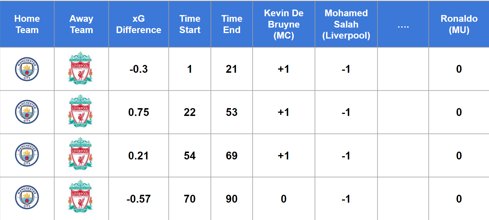
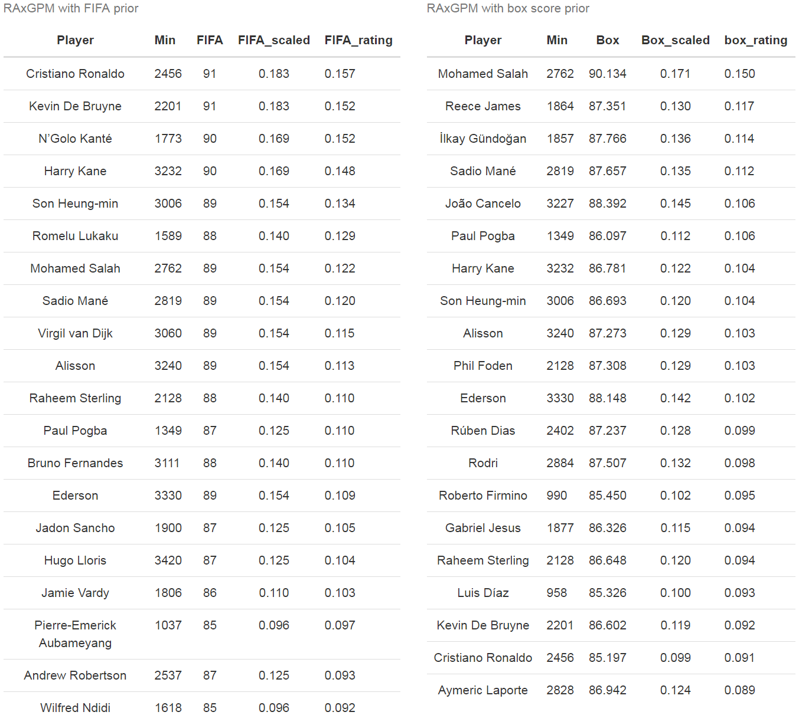

```{=html}
<style type="text/css">


h1.title {
  font-size: 40px;
  color: DarkRed;
  text-align: center;
}
h4.author { 
    font-size: 20px;
  font-family: "Times New Roman", Times, serif;
  color: DarkRed;
  text-align: center;
}
h4.date { 
  font-size: 20px;
  font-family: "Times New Roman", Times, serif;
  color: DarkBlue;
  text-align: center;
}
</style>
```
```{r setup, include=FALSE}
knitr::opts_chunk$set(echo = FALSE)
knitr::opts_chunk$set(warning = FALSE)
knitr::opts_chunk$set(message = FALSE)
```


## **I. Introduction**

One of the most well-known frameworks for constructing all-in-one player performance metrics is the plus-minus model, which in the most rudimentary form has been applied in hockey since the 1950s. The plus-minus model considers the number of goals scored minus the number of goals conceded when a given player is in the game. A huge problem with this approach is that it does not control for the impact of teammates or opponents. It is important to acknowledge that every player on the pitch, either directly or indirectly, is contributing to the overall team's performance. Several academic studies have started to utilize linear regression as an adjusted plus-minus (APM) framework to include other players' influence on that individual's rating. APM and its variations have most commonly been seen in basketball and hockey, achieving substantial improvements in these fields, an example being ESPN's widely known real plus-minus (RPM).


As a sport, soccer has numerous inherent disadvantages when it comes to APM, especially compared to basketball or hockey. Soccer is a low-scoring game with few substitutions, which means a traditional APM for the sport will have collinearity issues and an infrequent response variable. The collinearity comes from the low number of substitutions since some players will share the same minutes on the court together in almost every segment, which eventually makes them indistinguishable. Out of these three sports, basketball is the best sport to calculate APM for, and whereas hockey is low-scoring, it has an extremely high number of substitutions every game. Several scholars have tried to handle this challenge, considerably the paper from the Department of Statistics at Carnegie Mellon University, which introduces the use of video game ratings from FIFA as a prior in the APM model.


This paper aims to build up on the foundations of calculating individual player ratings using a plus-minus framework. This procedure ensures that the one-number statistics for soccer players accurately represent the individuals' skill level as well as their team contribution by adding the traditional box-score rating into the measurement of the APM model. Our approach also uses expected goals instead of the actual goals as we believe this will better measure the team's performance within a match. The remainder of this paper will be organized as follows. Section 2 describes the dataset that we use. Section 3 goes into detail about the different stages of our method. Sections 4 and 5 summarize the results and discuss the project's limitations and propose several next steps for further research. The last section will be the acknowledgments for people that have helped us to publish this work.


## **II. Dataset**


### **1. Prior Stage**


In the construction of individuals' ratings, we use two different datasets. First of all, we collected box-score statistics for each player in the Premier League season 2020-21 and 2021-22 from FBref.com, which is the soccer section of the ["Sports Reference Website"](https://www.sports-reference.com/). This data set contains all the players from five majors League in Europe, with each observation being a player along with over 180 variables describing their information and box-score statistics. The variables that are considered describe different actions in soccer, such as scoring, creating chances, dribbling, passing and defensive actions. We only include players who had at least 900 minutes in the field last season in order to reduce the bias in which players that usually start from the bench benefits from the team's results.


The second data set we collected is FIFA ratings from 2021 on the website ["SoFIFA.com"](https://sofifa.com/). The website contains different characteristics to measure the players, but we stick with the one-number overall statistics for each player. We merge these two datasets by players' names, resulting in several missing values as the names are recorded slightly differently between the two data sources. This missingness is handled by manual matching. Figure 1 shows the distribution of EPL FIFA 2022 ratings.


<center>


```{r}
library(ggplot2)
fifarating <- read.csv("C:/Users/ad/Desktop/CMU/SURE-CMU/Final Project/data/eng2021_boxscores.csv")
ggplot(data=fifarating, aes(x=overall)) +
    geom_histogram(color="lightblue", fill="steelblue", bins = 15) + 
    labs(title="EPL FIFA Rating Season 2022", x = ("FIFA Rating")) + 
  theme(plot.title = element_text(color="Black", size=12, face="bold", hjust = 0.5),
axis.title.x = element_text(color="black", size=12, face="bold"),
axis.title.y = element_text(color="black", size=12, face="bold"))
```


</center>


The distribution is the frequency of the FIFA Rating among players, where the x-axis represents the ratings, and the y-axis is the frequency. The histogram is close to a normal distribution, in which a great proportion of the observations is in the range of 72 to 83.


### **2. RAPM Stage**


In this stage, with the purpose of getting expected goals for each stint, we also have two different datasets. In order to create the stint dataset, we collected the match summary and line-up information for every match in the 2021-2022 English Premier League season. The dataset created for the purpose of RAPM consists of "stints" as rows and indicator columns for each player, as well as some other columns to adjust for red cards and game state. The response variable is expected goal difference (home - away) per 90 mins. A stint is defined as a period of time within a match in which there are no substitutions and no goals scored. A new stint is generated whenever there is a substitution since the players on the field change, and whenever there is a goal since the game state changes. Using this setup, a single player's individual impact on their team's (expected) goal difference per 90 minutes can be estimated with ridge regression, with the length of the stints as weights. This dataset contains almost 4000 stints across 380 matches, which means a match has an average of over 10 stints. The following plots describe the distribution of the number of stints per match in the EPL 2021-22.


<center>


```{r}
library(ggplot2)
library(dplyr)
xG_df <- read.csv("C:/Users/ad/Desktop/CMU/SURE-CMU/Final Project/data/eng1_2122_singleapm_stint_eg.csv")
xG_df <- xG_df %>% dplyr::count(matchID)
ggplot(data=xG_df, aes(x=n)) +
    geom_histogram(color="lightblue", fill="steelblue", bins = 10) + 
    labs(title="Distribution of Stints Per Game EPL 2021-22", x = ("Number of Stints")) + 
  theme(plot.title = element_text(color="Black", size=12, face="bold", hjust = 0.5),
axis.title.x = element_text(color="black", size=12, face="bold"),
axis.title.y = element_text(color="black", size=12, face="bold"))
```


</center>


As we can see from the distributions, almost 150 matches have 8 or 9 stints, while more than 150 teams have a number of stints ranging from 10 to 14. There are several potential outliers that may be resulted from a no-substitution match or multiple goals are scored from both sides.


The next step in this stage is to have the shooting information match-by-match. Once again, we collect this information from ["Sports Reference Website"](https://www.sports-reference.com/) An observation in this data frame represents a shot made by a player in that game, along with its expected goal value. We also consider several key factors from this dataset such as the minute of the shot, the player's name, the team's name, and many more.

After collecting these two data sets, we start the merging process to generate the expected goal difference between the home and away teams during a stint. The joining conditions are based on the Match ID, which is the concatenated string of the home team and away team, and whether the shot is made during the stint or not. The table below is a sample dataset that represents the Manchester City vs Liverpool match last EPL season.  

<center>



</center>

## **III. Methodology**


### **1. Prior Rating Model**

In order to create prior ratings for the players, box-score player-level statistics are used to estimate player ratings from the video game FIFA. More specifically, player statistics from the 2020-2021 EPL season are used to estimate player ratings from FIFA 22, since these ratings are given right after the 2020-2021 season. A standard multivariate linear regression is used to fit the model. As we have seen in the previous section, the distributions for the FIFA 22 rating is close to normal, so a linear regression is an appropriate method here.


### **2. RAPM Model**


After constructing an individual rating, our next consideration is to implement these results into the RAPM Model. Dr. Kostas Pelechrinis, our advisor for this project, suggests using Ridge Regression as the RAPM framework, but instead of shrinking the coefficients towards zero, we make several adjustments to have the coefficients shrink towards the priors ratings. Specifically, here is the formula to determine the coefficient of this linear regression:


```{=tex}
\begin{equation}
\beta = (X^{T}X)^{-1}(X^{T}y)
\end{equation}
```
In the above equation:

<center>

$\beta$: hypothesis parameters that define it the best.


$X$: Input feature value of each instance.


$y$: Output value of each instance.

</center>

The idea of having a regularized term in the above formula, or using Ridge Regression, is suitable for the task of interpreting a player's contribution to their team. Since we are creating a variable or a column for each player in the league, the dimension of the data is huge, which makes itself vulnerable to overfitting. By adding a regularized term into the formula above, we simultaneously constrain the parameters to be relatively small as well as maintain the goal of minimizing mean squared error from the model. We can see the formula for Ridge Regression.


```{=tex}
\begin{equation}
\beta = (X^{T}X + \lambda I)^{-1}(X^{T}y)
\end{equation}
```

We introduce $\lambda$ as a penalty term and an identity matrix in the Ridge Regression Formula. The discussion of using Ridge or Lasso or their combination (Elastic Net) is also interesting. The goal of this model is to interpret each individual's contribution to the overall team; therefore, using Lasso, i.e allowing the coefficient to be equal to 0, will likely ignore the contribution of a player whose rating is average. In order to shrink the coefficient towards the priors, another term will be introduced in the formula:

```{=tex}
\begin{equation}
\beta = (X^{T}X + \lambda I)^{-1}(X^{T}y + I*L)
\end{equation}
```

### **3. Implementation**


In this section, we will go further into details about the process of training and testing our model. In particular, some important transformation and manipulation we have made based on Ridge Regression to build our model.


#### **3.1 Model Training**

To begin with, the objective function of the Ridge Regression is:
$$
  \begin{align}
    \beta^* &= \arg \min_{\beta} ||y - X\beta||_2^2 + \lambda||\beta||_2^2 \\
    & \Leftrightarrow Ridge(y, X, \lambda)
  \end{align}
$$
where $\beta^*$ is our coefficient estimator, $\lambda$ is our parameter, $X$ and $y$ are our predictor matrix and response vector, accordingly. 
We could denote our parameter of interest $\beta^*$ as an output of the function $Ridge(y, X, \lambda)$.

Now we introduce a prior value $\beta_{prior}$ to each coefficient $\beta$. Note that $\beta_{prior}$ is a constant that we have already known from the prior stage, rather than a random variable. So our model is only performing a point estimation based on prior value without assuming any distribution on priors.
$$
  \begin{equation}
    \beta^* = \arg \min_{\beta} ||y - X\beta||_2^2 + \lambda||\beta - \beta_{prior}||_2^2
  \end{equation}
$$
So now we are penalizing coefficient $\beta$ for being far away from its prior $\beta_{prior}$. As a result, $\beta$ will shrink toward $\beta_{prior}$, instead of $0$.


However, in order to better tune the parameter $\lambda$ using the existing package for Ridge Regression, we have performed the following manipulation, where our goal is to transform the coefficients in the Ridge Regression model from $\beta$ to $\beta - \beta_{prior}$ and to estimate $\beta^* - \beta_{prior}$. 

We shall begin by defining:

$$
  \begin{align}
    & \theta := \beta - \beta_{prior} \\
    \Leftrightarrow & \beta = \theta + \beta_{prior}
  \end{align}
$$
Now, by substituting $\beta$ in the previous equation with $\theta + \beta_{prior}$, we have:
$$  
    \begin{align}
      \beta^* &= \arg \min_{\beta} ||y - X\beta||_2^2 + \lambda||\theta||_2^2 \\
      \theta^* &= \arg \min_{\theta} ||y - X\beta_{prior} - X\theta||_2^2 + \lambda||\theta||_2^2 \\
      &\Leftrightarrow Ridge(y - X\beta_{prior}, X, \lambda)
    \end{align}
$$

Thus, we have a new Ridge Regression model, where our new parameter of interest $\theta^*$ is in fact, $\beta^* - \beta_{prior}$, and our new response vector becomes $y - X\beta_{prior}$, while the predictor matrix and the parameter remain unchanged.
We could denote our new estimator $\theta^*$ as an output of the function $Ridge(y-X\beta_{prior}, X, \lambda)$.

Then, we could easily convert back to get an estimator for $\beta^*$ by:

$$
  \begin{align}
    \beta^* &= \theta^* + \beta_{prior} \\
    &= Ridge(y - X\beta_{prior}, X, \lambda) + \beta_{prior}
  \end{align}
$$


Now, we also want to introduce weights for the time length of each stint. Intuitively, we could imagine that longer stints would produce larger responses, that is a larger expected goals differential. To accommodate this, we introduce the a time vector $t$, which is the length of each stint. And we could replace our predictor matrix $X$ by $tX$. Therefore, our training model eventually becomes:
$$
  \begin{equation}
    \beta^* = Ridge(y - tX\beta_{prior}, tX, \lambda) + \beta_{prior}
  \end{equation}
$$
where $\beta^*$ is our estimator for coefficients of each random variables, meaning the RAxGPM value for each player, which is the output of our entire RAxGPM model as well; $t$ is the length of each stint, acting as a weight vector in our model; $\beta_{prior}$ is the prior value for each random variable, meaning the prior rating for each player that we have created using box score in the prior stage; $\lambda$ is the parameter we have tuned for $l_2$ penalization; and lastly, $X$ and $y$ are our predictor matrix and response vector, accordingly, as shown in the figure in section 2.2. 


####  **3.2 Model Testing**


For the evaluation of our model, since we could not find an objective indicator for player's individual performance and contribution within a specific time period, we decided to perform testing on the prediction accuracy of the response variable we have chosen, which is expected goals differential.

As our training model is defined and illustrated in the previous section, the prediction of the response variable, the predicted expected goal differential, $\hat{y}$ could be obtained by:
$$
  \begin{equation}
    \hat{y} = tX\beta^* = tX\theta^* + tX\beta_{prior}
  \end{equation}
$$

Now, we could test our model's prediction accuracy by defining the prediction error as the Root Mean Square Error:
$$
  \begin{align}
    \textbf{Prediction Error} &= \sqrt{\sum_{\text{stint}} \frac{(\text{predicted xG differential} - \text{actual xG differential})^2}{\text{number of stint}}} \\
    &= \sqrt{\sum_{\text{stint}} \frac{(\hat{y} - y)^2}{\text{n}}}
  \end{align}
$$
```{r echo=FALSE, warning=FALSE, message=FALSE}
library(tidyverse)
library(ggplot2)
```


# **IV. Results**


In this section, we first compare the prediction accuracy of the following RAxGPM model : 

  - **RAxGPM_only**: RAxGPM without any prior
  - **RAxGPM_FIFA**: RAxGPM with FIFA rating directly used as prior
  - **RAxGPM_box**: RAxGPM with prior created from box score stats as mentioned in section 3.1

Through 10-fold cross-validation to iterate through the 2021-22 season of the EPL, we measured each model's ability on making out-of-sample predictions. As described in section 3.3.2, our accuracy is measured by the mean of root mean squared error (RMSE) of the predicted expected goal difference per 90 minutes of each observation with the actual expected goal difference per 90 minutes within each fold.

<center>
  \plot
```{r echo=FALSE, warning=FALSE, message=FALSE}
holdout_predictions <- read.csv("C:/Users/ad/Desktop/CMU/SURE-CMU/Final Project/data/holdout_predictions.csv")
holdout_predictions %>%
  rename(RAxGPM_box = ridge_new_pred_preds,
         RAxGPM_FIFA = ridge_FIFA_preds,
         RAxGPM_only = ridge_APM_preds) %>%
  pivot_longer(c(RAxGPM_box, RAxGPM_FIFA, RAxGPM_only),
               names_to = "model", values_to = "test_preds") %>%
  group_by(model, test_fold) %>%
  summarise(RMSE = sqrt(mean((test_actual - test_preds)^2))) %>%
  ggplot(aes(x = model, y = RMSE)) +
  geom_point() + 
    labs(title="Comparison of prediction accuracy of RAxGPM models ", x = ("Model")) + 
  theme(plot.title = element_text(color="Black", size=12, face="bold", hjust = 0.5),
axis.title.x = element_text(color="black", size=12, face="bold"),
axis.title.y = element_text(color="black", size=12, face="bold"))+
  stat_summary(fun = mean, geom = "point", color = "red") + 
  stat_summary(fun.data = mean_se, geom = "errorbar", color = "red")
```

</center>

As shown in the figure above, the RAxGPM model with FIFA rating as a prior improves on the RAxGPM model without any prior, which shows that having a prior is indeed adding valuable information to the model. Our RAxGPM model with prior created from box score has the best predictive accuracy, which shows that box score stats are more valuable as a predictor than FIFA rating.


Moreover, we are also interested in if our model has more descriptive power on player's evaluation. Regularized Adjusted Plus-Minus models are often validated by an “Intraocular” test, in that, it’s better if the results make intuitive sense to soccer fans. (Matano et al, 2018) Here, we expect that the box score prior we created is more descriptive of the player's performance within a specific time period compare to the FIFA rating.

  \table
```{r echo=FALSE, warning=FALSE, message=FALSE}
prior <- read.csv("C:/Users/ad/Desktop/CMU/SURE-CMU/Final Project/data/prior.csv")
rating <- read.csv("C:/Users/ad/Desktop/CMU/SURE-CMU/Final Project/data/eng1_2122_singleapm_rating.csv")

new_prior <- prior %>%
  select(Player, total_min, adj_overall, adj_scaled, weighted_pred, pred_scaled) %>%
  rename(Min = total_min,
         FIFA = adj_overall,
         FIFA_scaled = adj_scaled,
         Box = weighted_pred,
         Box_scaled = pred_scaled)

FIFA_table <- new_prior %>%
  select(-Box, -Box_scaled) %>%
  left_join(select(rating, c(Player, FIFA_coef, FIFA_rating))) %>%
  arrange(desc(FIFA_rating)) %>%
  head(20)

box_table <- new_prior %>%
  select(-FIFA, -FIFA_scaled) %>%
  left_join(select(rating, c(Player, box_coef, box_rating))) %>%
  arrange(desc(box_rating)) %>%
  head(20)

```

<center>

  
  
</center


<div class="col2">

```{r two-tables, results='asis', echo=FALSE, warning=FALSE, message=FALSE}
#library(knitr)
#library(svglite)
#library(kableExtra)

#FIFA_table %>%
#  dplyr::select(-5) %>%
#  kable("html", align = 'clc', caption = 'RAxGPM with FIFA prior', digits = 3) %>%
#    kable_styling(full_width = F, )
 
#box_table %>%
#  dplyr::select(-5) %>%
#  kable("html", align = 'clc', caption = 'RAxGPM with box score prior', digits = 3) #%>%
#    kable_styling(full_width = F)
```

</div>

The table above compares the top 20 players from the RAxGPM model with box score prior created from the 2021-22 season and the RAxGPM model with FIFA rating prior collected at the end of the 2021-22 season. We have also included the corresponding result in the table.
As expected, RAxGPM model with FIFA rating prior gives higher value to players with higher FIFA ratings, while RAxGPM model with box score prior gives higher value to players with better box score performance in the season. 
We could observed that some players appear in top 20s of the result from both model, while some players only appear in the top 20s of the result from either model.

However, the ranking of the players in both tables are quite different. This is somewhat expected because the box score stats we used to create the prior rating for each player is from 2021-22 season EPL only, while the FIFA rating for each player, though collected at the end of the 2021-22 season, is based on the entire career of the player so far. Thus, we would expect that the RAxGPM model with box score prior would produce a result that is more catered to the player's performance within a specific time period (in this case, 2021-22 season EPL), rather than RAxGPM model with FIFA prior takes more account for player's career history, which is outside of the window that we are looking at. 
This align with our main purpose of the model that is to evaluate a player's performance and contribution in a specific time period, and this also explained why RAxGPM model with box score prior has better prediction accuracy for the response variable we have chosen with this specific time period, in our case the 2021-22 season EPL.

For example, Cristiano Ronaldo, who had the highest FIFA rating going into the season, had a below-par season compared to his historical standards. This is also reflected in our model, with his score being much lower when using a box-score informed prior compared to a FIFA rating prior.
Moreover, Mohamed Salah has received a much higher rating in RAxGPM model with box score prior than FIFA rating prior, which effectively reflects his performance over the past season, where he has been awarded the PFA player of the year.
These are good signs for the intraocular test for our model.


## **V. Discussion**


Our project introduces a new kind of Regularized Adjusted Expected Goal Plus-Minus model(RAxGPM) in soccer to evaluate players' performance, in which we incorporate priors generated from box-score data into a regularized regression framework. We've also decided to use expected goals differential per 90 as the response variable in order to increase the predictability of our model and have a more frequent response variable compared to actual goals.

Unlike previous work that has employed a Bayesian framework, our model is only performing a point estimation on the response variable through a regularized linear model with a prior, which does not require any assumption on the prior distribution.

We have also shown that the RAxGPM model with the prior we created from box score data has better out-of-sample prediction accuracy than the RAxGPM model with FIFA rating as prior, and without any prior, which proves that by incorporating box score data, we are indeed adding more valuable information to our model.  


However, there are still many directions for future work, and we believe that it takes time to fully develop a good Plus-Minus model in general in soccer. Some of the possible future development could be:

  - adding more data, increasing sample size to enhance model training and prediction accuracy
  - employing more supervised learning techniques to increase prior model quality
  - bagging to improve the stability and the accuracy of RAxGPM model
  - choice of response variable: could we find a better measurement for soccer?
  - implementing tracking data to build a more comprehensive model
  - constructing Bayesian framework to add uncertainty to the model through distribution

Some of the potential applications of our model could be:

  - evaluating players across different leagues
  - predicting player's market value and salary
  - optimal line-up recommendation
  - predicting game results and simulating league result


## **VI. Acknowledgments**


We thank our project advisors Dr. Konstantinos Pelechrinis (University of Pittsburgh) and Dr. Ronald Yurko (Carnegie Mellon University) for their guidance and encouragement throughout this project. Their help has been greatly appreciated. 
We also want to thank the entire cohort of the 2022 Carnegie Mellon Sports Analytics Camp(CMSAC), the Teaching Assistants, as well as the faculties and guest speakers for their help and encouragement throughout the summer.
Lastly, we want to express our gratitude to the Department of Statistics and Data Science at Carnegie Mellon University for sponsoring this research project.
  
  
## **VII. Reference**


Hvattum, L. (2019). A comprehensive review of plus-minus ratings for evaluating individual players in team sports. International Journal of Computer Science in Sport. 

Matano, F., Richardson, L. F., Pospisil, T., Eubanks, C., & Qin, J. (2018). Augmenting adjusted plus-minus in soccer with FIFA ratings. arXiv preprint arXiv:1810.08032. 

Rosenbaum, D. T. (2004, April 30). Picking the difference makers for the All-NBA Teams. 82games.com. Retrieved July 28, 2022, from https://www.82games.com/comm30.htm

Sill, J. (2010). Improved NBA adjusted+/-using regularization and out-of-sample testing. *In Proceedings of the 2010 MIT Sloan Sports Analytics Conference.*


